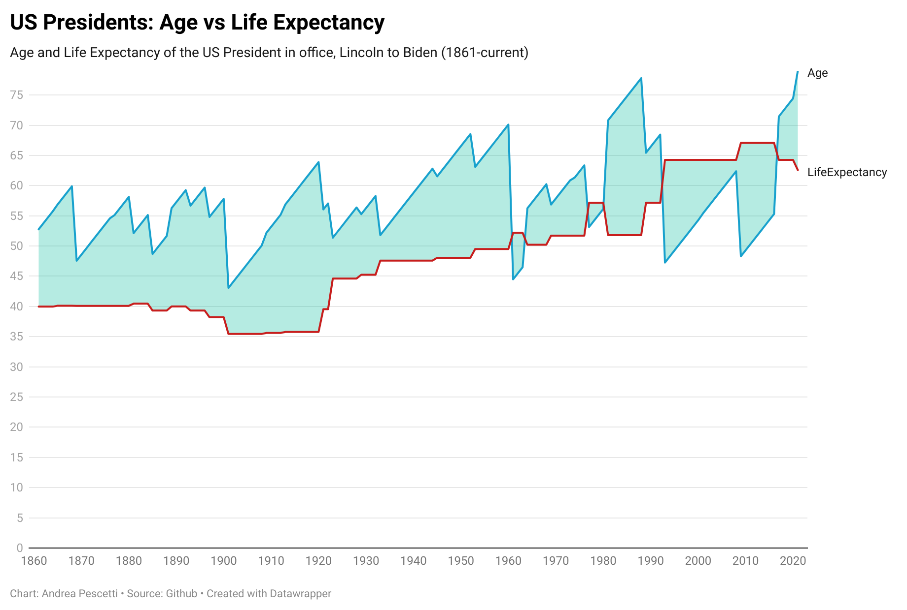
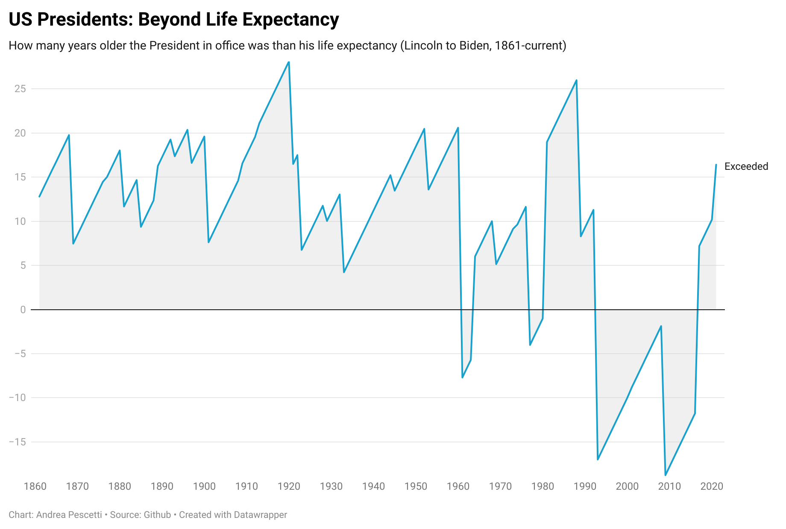

# US Presidents: Age vs Life Expectancy

Data, tools and scripts for the [Long Live the President?](https://medium.com/@pescetti/long-live-the-president-2f82d31adbfc)
story, November 2021.

## Scripts

Python environment setup:
```
$ conda env create -f environment.yml
$ conda activate us-presidents-age
```

Then run:
- `$ ./clean-wikipedia-data.sh` to quickly clean up Wikipedia data
- `$ python extract-presidents.py` to (re)generate `data/presidents.csv`
- `$ python merge-data.py` to (re)generate `data/presidents-age-life-expectancy.csv`

The final CSV file can then be fed to [DataWrapper](https://datawrapper.de) to generate visualizations.

## Data Sources

- Wikipedia: [List of US presidents by age](https://en.wikipedia.org/wiki/List_of_presidents_of_the_United_States_by_age).
- Our World in Data: [Life expectancy](https://ourworldindata.org/life-expectancy) and namely [US data by gender](https://ourworldindata.org/grapher/life-expectation-at-birth-by-sex?country=~USA).

## Charts

Done with [DataWrapper](https://datawrapper.de):





Interactive versions: see [Long Live the President?](https://medium.com/@pescetti/long-live-the-president-2f82d31adbfc).
